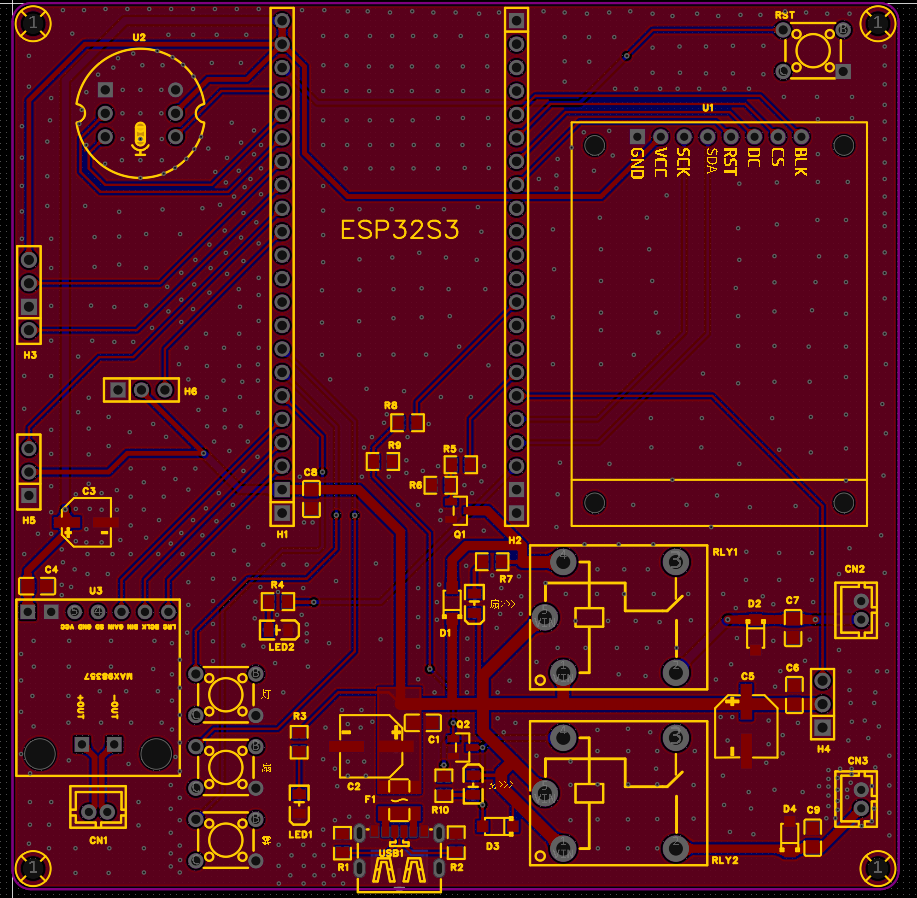
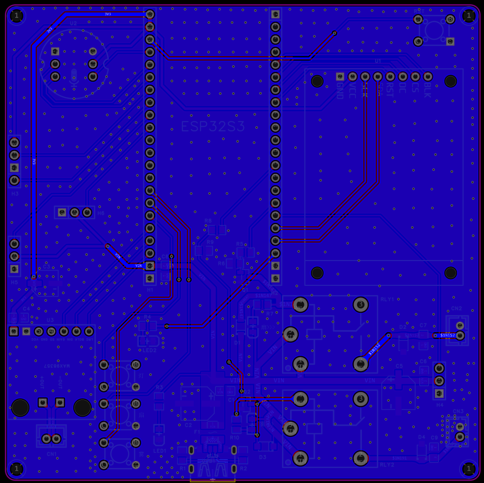

# My-First-ESP32S3

# 基于 ESP32-S3 的离线语音控制智能家居中枢系统 🚀

一个集成了边缘侧机器学习（TinyML）、全数字音频链路、多协议通信与多模态交互的智能家居边缘网关。

## 🌟 核心特性
* **边缘侧离线语音识别**：基于 Edge Impulse 训练神经网络模型，利用 ESP32-S3 的 AI 向量指令集（ESP-NN）进行边缘端硬件加速，3米内识别率 >85%，本地响应延迟 <200ms。
* **全数字音频交互链路**：采用 INMP441（I2S输入麦克风）与 MAX98357（I2S功放），从源头上规避传统模拟音频的 PCB 电磁底噪。
* **多模态混合控制**：支持“离线语音 + 物理按键 + 微信小程序（MQTT）”三位一体融合控制，具备完善的云端状态双向同步机制与离线自适应模式。
* **工业级硬件防护**：设计星形布线电源分配网络（PDN），集成 4A PPTC 自恢复保险丝与大容量缓冲电容，彻底隔离感性负载（继电器/舵机）的电动势反向冲击。

## 🛠️ 硬件物料清单 (BOM) & 接口协议
| 模块名称 | 核心芯片/型号 | 通信协议/接口 | 作用 |
| :--- | :--- | :--- | :--- |
| 主控核心 | ESP32-S3 (Xtensa LX7) | - | 算力中心、网络协议栈 |
| 语音输入 | INMP441 | I2S | 离线语音信号采集 |
| 环境感知 | DHT20 | I2C | 温湿度数据采集 |
| 动力执行 | SRD-05VDC | GPIO (三极管饱和驱动) | 风扇、加湿器强电控制 |

## 📐 硬件电路与 PCB 设计

本项目基于双层板架构（1oz 铜厚）进行独立 Layout，实现了高载流下的电源完整性（PI）与电磁兼容（EMC）调优。

### 1. 原理图设计亮点 (Schematic)
* 设计了 4A PPTC 自恢复保险丝与大容量储能电容组合的输入防护级。
* 针对继电器与舵机等感性负载，设计了 SS8050 三极管深饱和驱动电路，并反向并联续流二极管进行高压反向电动势（Back-EMF）隔离。

>[点击此处查看完整原理图 PNG](./GP_26.5.11_IR_v0.7/Hardware/Previews/系统原理图.png)

### 2. PCB Layout 渲染图 (PCB Layout)
* **星形拓扑布线**：电源分配网络（PDN）采用星形走线，主供电轨走线宽度达 180 mil。
* **射频与地平面优化**：2.4GHz 天线区域实施 5mm 严格净空；全板实施双面大面积覆地，并利用地过孔阵列（Via Stitching）强力耦合回流路径。

## 🚀 快速上手
1. 克隆本项目：`git clone ...`
2. 使用 VS Code + PlatformIO 打开。
3. 修改 `src/config.h` 中的 WiFi 与 OneNET MQTT 凭证。
4. 点击 Upload 烧录至 ESP32-S3。
